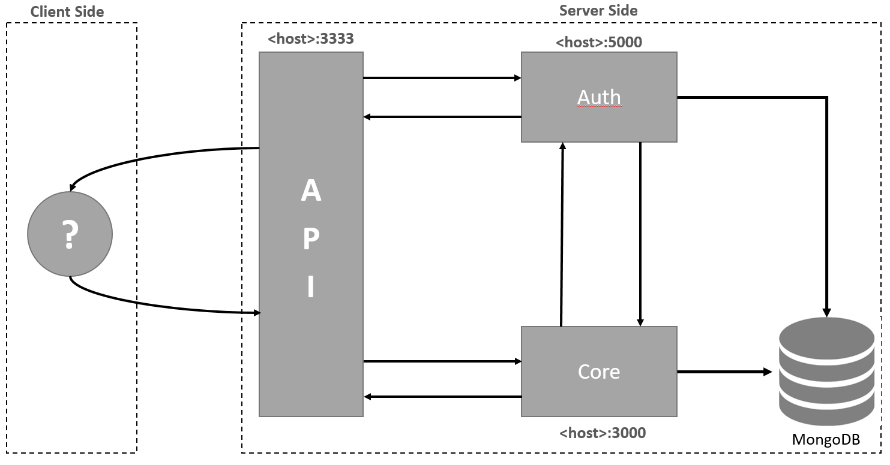

# An example of distributed servers

## Dependencies
- [NodeJS/NPM](https://nodejs.org/en/): JavaScript runtime.
- [Yarn](https://yarnpkg.com/en/): Dependency management.
- [MongoDB](https://www.mongodb.com/): Document-based and distributed database.

## Architecture
This project contains 3 distinct servers which can be deployed separately and communicate each other. Use the file `.env` within each project to configure each server. All communication between these servers is realized by REST/HTTP.

### Auth Server
Is the authentication server. Communicates with database to authenticate users and generate JWT (Json Web Token). Also is used by Core Server to validate the token provided by requests in Core's protected routes.

### Core Server
Server responsible to manipulate entities (e.g "Movie") inside database. Has protected routes which needs to receive a valid token to execute. In cases where token is not provided or wrong, Auth Server will return an error and the Core's protected routes will not be accessible.

### API Server
Server used to expose the funcionalities of backend to external users and systems. Has all routes necessary to interacts with all servers.

#### API Endpoints
Find below all endpoints exposed by API server. Payload examples are available in Postman collection within this repo: ``DS Servers.postman_collection.json``.

`POST http://<api_host>:<api_port>/auth/login`: used to authenticate the user.  
`POST http://<api_host>:<api_port>/auth/logout`: fake route just to inform client to delete token.  
  
`POST http://<api_host>:<api_port>/user`: create a new user.  
`PATCH http://<api_host>:<api_port>/user`: update an existing user.  
`GET http://<api_host>:<api_port>/user/<id>`: find an user by ID, if ID is not provided find all users.  
`DELETE http://<api_host>:<api_port>/user`: delete an existing user.  
  
`POST http://<api_host>:<api_port>/movie`: create a new movie.  
`PATCH http://<api_host>:<api_port>/movie`: update an existing movie.  
`GET http://<api_host>:<api_port>/movie/<id>`: find an movie by ID, if ID is not provided find all movies.  
`DELETE http://<api_host>:<api_port>/movie`: delete an existing movie.  

## Configuration
Each project (folder) has a `.env` file which contains environment variables used to start each server.

### Auth Server `.env` configuration

`PORT`: port used to run Auth Server.  
`DB_URL`: URL of the database.  
`DB_NAME`: name of database that will be created by the application.  
`SECRET`: keyword used by JWT to generate tokens.  

### Core Server `.env` configuration

`PORT`: port used to run Core Server.  
`DB_URL`: URL of the database.  
`DB_NAME`: name of database that will be created by the application.  
`AUTH_SERVER`: address of Auth Server (e.g `http://localhost:5000`).  

### API Server `.env` configuration

`PORT`: port used to run API Server.  
`CORE_SERVER`: address of Auth Server (e.g `http://localhost:3000`).  
`AUTH_SERVER`: address of Auth Server (e.g `http://localhost:5000`).  

## Dependencies and Execution
Before run each server run the following command (once in each folder) to install the proper dependencies:

`yarn install`

To run each server open a command window in each folder and run the command below:

`yarn dev`

In Windows you can run only `runServers.cmd` to run both three servers.